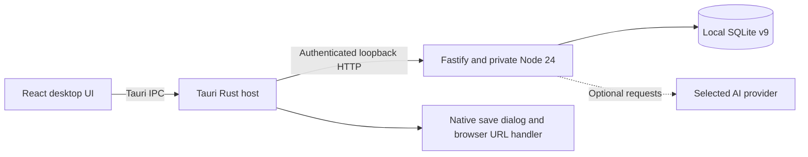

# LeetCode Tracker

<p align="center">
  
</p>

<p align="center">
  <a href="https://github.com/Yide-Milo-Li/LeetCode-Tracker/releases/tag/v1.0.1"></a>
  <a href="docs/desktop.md"></a>
  <a href="tests/README.md"></a>
  <a href="docs/architecture.md"></a>
  <a href="LICENSE"></a>
</p>

A local-first desktop workbench for algorithm practice: bring your own JSONL catalog, plan a weekly routine, record practice, review progress, and keep problem notes together. The interface supports English and Simplified Chinese, desktop windows at 1024px and above, ten theme palettes, and keyboard navigation.

Release 1.0.1 packages the React interface, Fastify API, SQLite engine, and a private Node.js 24 runtime in a Tauri Windows application. **End users do not need to install Node.js, npm, Git, or Rust.** The single download is an installer; the installed application contains several runtime files.

## Download and start

1. Open [Release 1.0.1](https://github.com/Yide-Milo-Li/LeetCode-Tracker/releases/tag/v1.0.1) and download **LeetCode-Tracker_1.0.1_x64-setup.exe**. The release also includes `SHA256SUMS.txt`.
2. Run the per-user Windows x64 installer, then launch LeetCode Tracker from the Start Menu.
3. Open **Problems → Import problems**, upload or paste your JSON Lines catalog, review the preview, and confirm the import.
4. Open **Today → Study schedule** to choose your days, daily counts, difficulty quotas, and review options.
5. Optionally configure an AI provider under **Settings**. Catalog browsing, manual practice, notes, statistics, and local planning remain available without an API key.

The installer is **unsigned**. Microsoft WebView2 is required; if it is missing, the installer downloads its bootstrapper, which requires internet access. Windows 11 x64 is the primary target; clean-machine installation, Windows 10 compatibility, and upgrade/downgrade acceptance have not completed the full verification matrix. See [installation, data paths, and troubleshooting](docs/desktop.md) and [1.0.1 release notes](docs/releases/1.0.1.md).

### Bring your own catalog

No proprietary problem dataset or crawler is shipped. Supply metadata you have permission to use, one JSON object per line:

```jsonl
{"id":"1","title":"Two Sum","difficulty":"Easy","tags":["Array","Hash Table"]}
{"id":"15","title":"3Sum","difficulty":"Medium","tags":["Array","Two Pointers"]}
```

These are format examples, not a bundled curriculum. An AI-generated catalog can contain incorrect IDs, titles, tags, or links; review it before importing. See the [JSONL specification](docs/data-format.md) for accepted fields and normalization rules.

## Practice, understand, and retain

### Today's practice


Define reusable weekly strategies with exact difficulty quotas, new/review counts, and topic preferences. Recommendations explain their source. Local code owns candidate membership, uniqueness, quotas, and persistence; optional Gemini, OpenAI, or DeepSeek assistance remains advisory. Failed planning requests can use a labelled deterministic fallback.

### Progress and topic insights


Record completion, duration, and notes; correct or revoke individual records without replacing unrelated history. Explore the yearly activity heatmap, recent trends, and topic insights. Imported progress snapshots are distinguished from individual practice records, and unknown history stays unknown.

### Notes and knowledge export


Keep Markdown solution notes beside each problem and its practice timeline. Export Markdown, an Obsidian ZIP, Notion CSV tables, or a portable snapshot bundle. The desktop app uses a native save dialog and atomically completes the selected file. Bundle exports omit provider keys, and bundle imports ignore incoming keys while preserving local credentials.

### Appearance and keyboard access

Ten palettes, a high-contrast option, English/Chinese text, and light/dark/system appearance support desktop work. Screenshots illustrate the UI; they are not evidence of the full native WebView2 acceptance matrix.

| Shortcut | Action |
| --- | --- |
| `1` / `2` / `3` / `4` | Today / Problems / Progress / Notes |
| `/` | Focus catalog search |
| `n` | Quick note for the active problem |
| `?` | Show keyboard help |
| `Esc` | Dismiss the active overlay |

See the [workflow guide](docs/desktop-workflow.md) for input guards and context-specific actions. Mobile UI is outside the supported scope.

## Data and optional AI

- The installed desktop profile stores SQLite and backups under `%LOCALAPPDATA%\com.leetcodetracker.desktop\`. It does not automatically adopt a source checkout's `.local` database.
- API keys are stored in local SQLite settings without operating-system credential encryption. Raw database backups can contain keys; keep them private.
- AI features send task-relevant inputs to the selected provider or configured gateway. These can include candidate problem metadata, strategy/override text, or pasted progress text. AI-assisted progress import requires a working provider and has no deterministic formatting fallback.
- Portable bundles exclude keys and are not a complete SQLite migration mechanism. Custom data-directory selection and a full desktop SQLite migration flow remain unfinished.

Read [AI provider behavior](docs/llm-providers.md) and the [security policy](SECURITY.md) before configuring a provider or sharing exports.

## Run from source

Source mode requires **Node.js >=24.15.0 <25** and npm. It uses a desktop browser and is separate from the packaged Windows app:

```sh
git clone https://github.com/Yide-Milo-Li/LeetCode-Tracker.git
cd LeetCode-Tracker
npm ci
npm run build
npm start
```

Open [the local workbench](http://127.0.0.1:3000). On Windows, `start.bat` / `npm run desktop` are source-mode launch helpers, not the native installer. Source mode supports optional `.env` configuration; the packaged host supplies its own database path, port, and private session credentials. Configure installed-app providers in Settings.

For a native build, install the Windows Rust/MSVC toolchain and run `npm run desktop:build`. The [desktop guide](docs/desktop.md) lists prerequisites, outputs, and checks.

## Architecture and verification



The host validates the startup handshake, owns the sidecar process through a Windows Job Object, and waits for graceful shutdown before enforcing its deadline. Browser source mode uses HTTP directly. See [architecture](docs/architecture.md).

The current local verification passed **312 JavaScript/Web/sidecar tests and 7 Rust tests**, TypeScript checking, documentation links, Rust formatting/clippy, and Windows installer packaging. These are automated/local results. They do not establish clean-VM installation, complete native UI/upgrade acceptance, live-provider availability, or performance guarantees. [Status](docs/status.md) separates current evidence from historical phase results; [CI](https://github.com/Yide-Milo-Li/LeetCode-Tracker/actions) reports remote runs independently.

## Documentation

- [Documentation index](docs/README.md) · [Desktop installation](docs/desktop.md) · [Release 1.0.1 notes](docs/releases/1.0.1.md)
- [Data format](docs/data-format.md) · [AI providers](docs/llm-providers.md) · [Topic insights](docs/topic-practice-insights.md)
- [Architecture](docs/architecture.md) · [Applications](apps/README.md) · [Shared packages](packages/README.md)
- [Tests](tests/README.md) · [Scripts](scripts/README.md) · [Roadmap](docs/roadmap.md)
- [Contributing](CONTRIBUTING.md) · [Security](SECURITY.md) · [Changelog](CHANGELOG.md)

## License

Code is available under the [MIT License](LICENSE). Users remain responsible for rights to supplied data.
