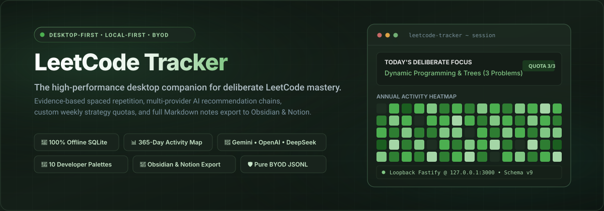
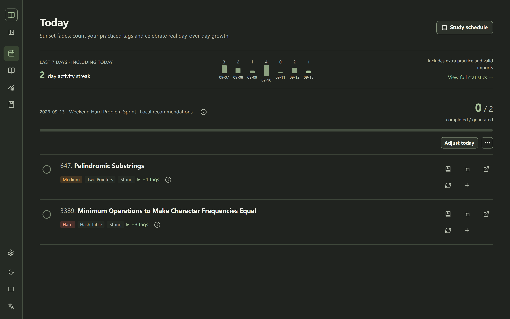
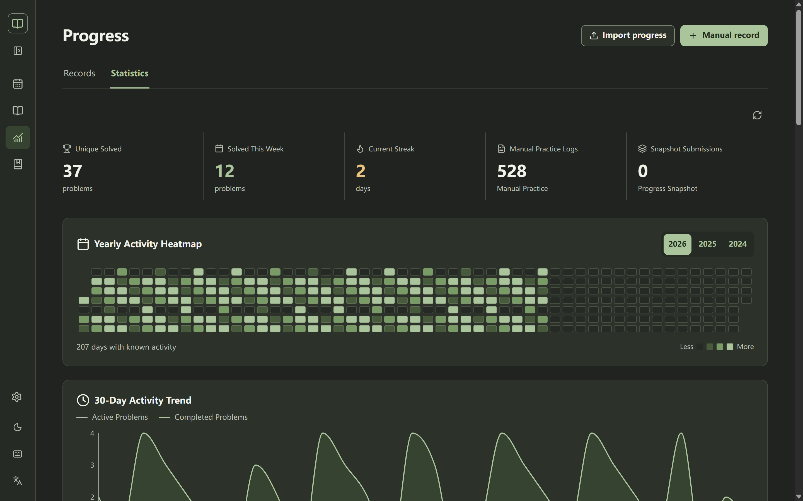
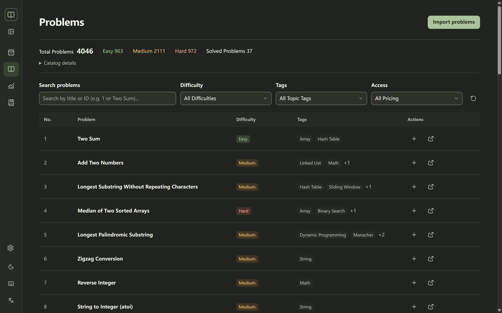
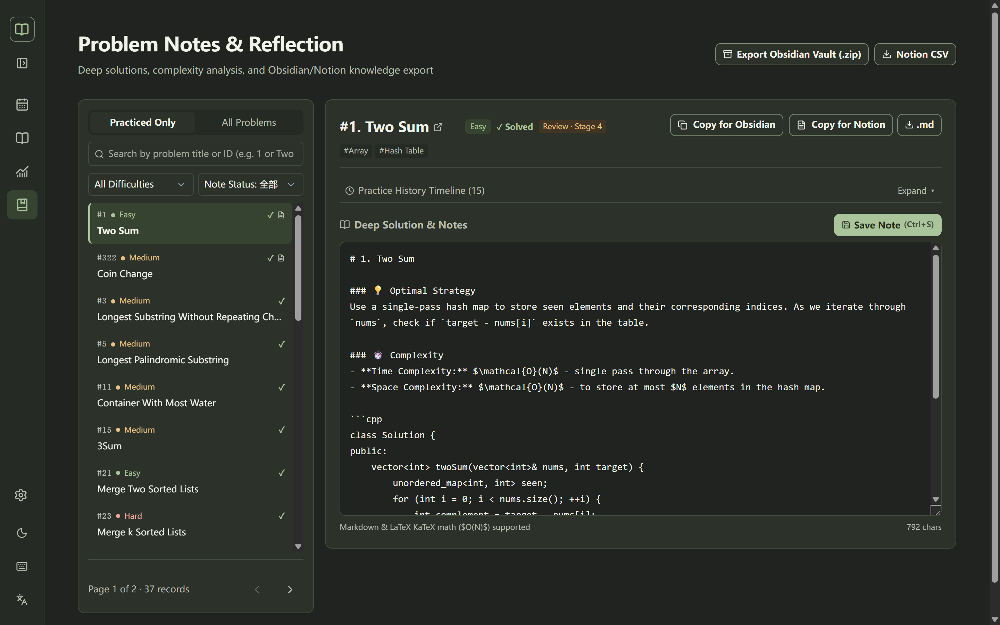
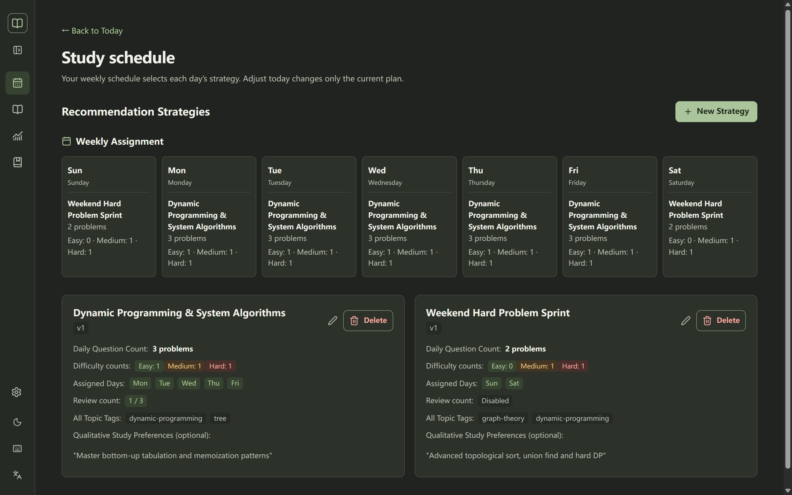
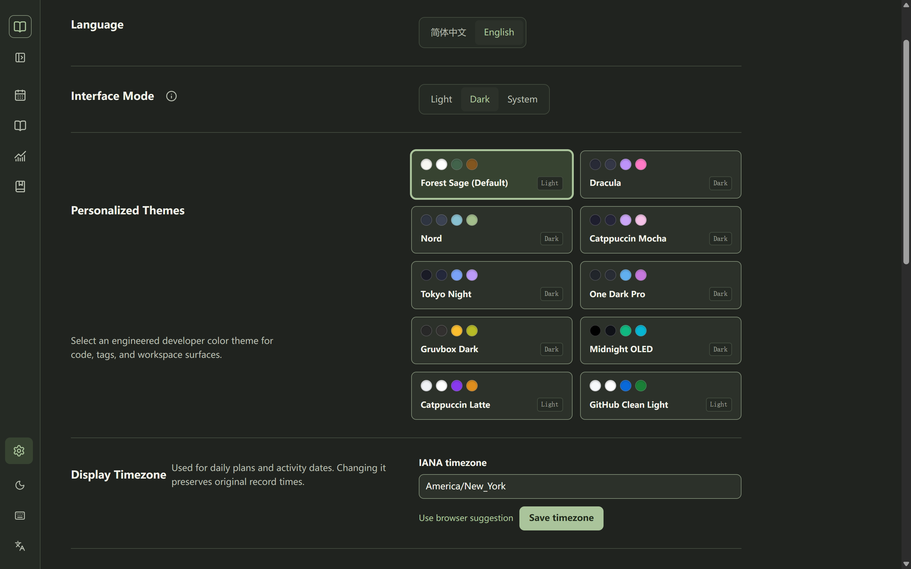
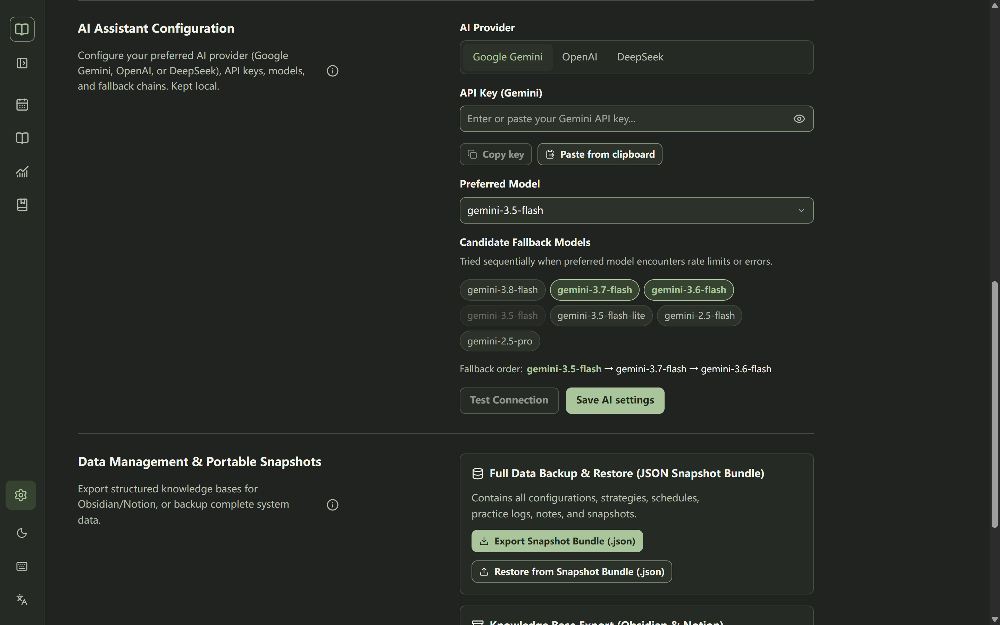
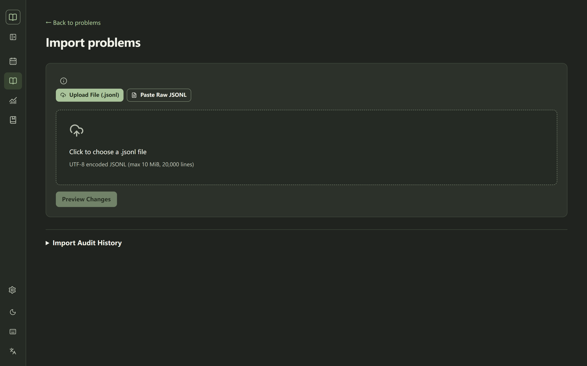

# LeetCode Tracker

<p align="center">
  
</p>

<p align="center">
  <a href="https://nodejs.org/"></a>
  <a href="https://www.typescriptlang.org/"></a>
  <a href="https://fastify.dev/"></a>
  <a href="tests/README.md"></a>
  <a href="docs/architecture.md"></a>
  <a href="docs/requirements.md"></a>
  <a href="LICENSE"></a>
</p>

---

## Overview

**LeetCode Tracker** is an engineered, local-first desktop application designed for deliberate algorithm practice. Unlike generic spreadsheet logs or cluttered extensions, it combines **rigorous weekly practice quotas**, **evidence-based spaced repetition**, **bilingual interface support (English / 简体中文)**, and **multi-provider AI recommendation chains** (Google Gemini, OpenAI, DeepSeek) with an offline sub-0.2ms deterministic fallback.

Built with **Node.js 24 native SQLite (`node:sqlite`)** and **React 19**, all your practice logs, notes, and study plans stay strictly on your local machine. It adheres to a strict **Bring-Your-Own-Data (BYOD)** philosophy: no proprietary web scrapers, no copyrighted problem repositories, and zero risk of vendor lock-in.

---

## Visual Showcase & Key Features

### 1. Today's Practice & Explainable AI Planning
> Focus on what matters today. Deliberate practice with time-aware bilingual encouragement and explicit reasoning behind every recommendation.

<p align="center">
  
</p>

- **Deliberate Study Queue**: Clear separation between new problem acquisitions and spaced repetition review targets.
- **Explainable Rationale**: Transparent bilingual explanation (*"Why this problem?"*) grounded in topic frequency, weak areas, or custom user preferences.
- **Instant Practice Logging**: Mark problems complete with duration, solution approaches, and difficulty self-rating in a single modal drawer.
- **Bilingual Encouragement**: Time-sensitive motivational quotes in English and Chinese that rotate based on your daily momentum.

---

### 2. 365-Day Activity Heatmap & Deep Analytics
> Track your long-term consistency with GitHub-style contribution graphs and algorithmic topic mastery radars.

<p align="center">
  
</p>

- **GitHub-Style Contribution Heatmap**: Complete 52-week visual history with customizable color thresholds and hover tooltips for daily counts.
- **30-Day Practice Velocity**: Rolling frequency curve comparing completed sessions versus review ratios.
- **Difficulty Distribution Rings**: Visual breakdown across Easy, Medium, and Hard problems with percentage quotas.
- **Algorithmic Topic Mastery**: Topic radar displaying practice frequency, average solve time, and days since last practice without opaque score penalties.

---

### 3. High-Performance Problems Catalog
> Instant client-side search and filtering across 4,000+ problems with zero lag.

<p align="center">
  
</p>

- **Instant Search**: Sub-millisecond filtering by problem ID, English title, Chinese title, or topic slug.
- **Multi-Attribute Filters**: Filter dynamically by difficulty (`Easy`, `Medium`, `Hard`), completion state (`Solved`, `Unsolved`), and topic tags.
- **Integrated Actions**: Launch note-taking or manually record an external practice session directly from catalog rows.

---

### 4. Master-Detail Notes Workspace & Second-Brain Export
> A distraction-free Markdown editor equipped with LaTeX math formulas, code blocks, and 1-click export to Obsidian and Notion.

<p align="center">
  
</p>

- **Master-Detail Layout**: Fast left-hand problem switcher paired with a rich split-pane Markdown editor and previewer.
- **Mathematical Complexity**: Full LaTeX rendering for asymptotic complexities ($\mathcal{O}(N \log N)$) and recurrence relations.
- **Obsidian & Notion Ready**: Single-click copy buttons for Obsidian Callouts (`[[wikilink]]`) and Notion card toggles.
- **Vault Export Engine**: Download your entire problem catalog as a ready-to-use Obsidian Vault ZIP (with Dataview index frontmatter) or dual structured CSV files for Notion databases.

---

### 5. Weekly Schedule Strategies & Strict Difficulty Quotas
> Design predictable weekly routines with explicit difficulty distributions and customizable review modes.

<p align="center">
  
</p>

- **Weekday Strategy Mapping**: Assign specialized strategies to different days of the week (e.g. *"DP Tabulation on Weekdays"*, *"Hard Graph Sprint on Weekends"*).
- **Strict Quota Balancing**: Difficulty sliders (Easy / Medium / Hard) that strictly total your daily target, with automatic auto-fill balancing.
- **Three Review Modes**: Configure your spaced repetition intensity per strategy: *No Review*, *Balanced Partial Review (33%)*, or *Intensive All-Review (100%)*.

---

### 6. 10 Curated Developer Theme Palettes
> Tailored color schemes designed for focus and terminal aesthetic perfection, plus OLED black and High Contrast support.

<p align="center">
  
</p>

| Dark Themes | Light Themes | Accessibility Modes |
| :--- | :--- | :--- |
| **Forest Sage** *(Default)* | **Forest Light** | **High Contrast Light** |
| **Dracula Dark** | **Catppuccin Latte** | **High Contrast Dark** |
| **Nord Arctic** | **GitHub Clean Light** | **Reduced Motion Support** |
| **Catppuccin Mocha** | | |
| **Tokyo Night** | | |
| **One Dark Pro** | | |
| **Gruvbox Dark** | | |
| **Midnight OLED** | | |

---

### 7. Multi-Provider AI Architecture (Gemini • OpenAI • DeepSeek)
> Seamless integration with industry-leading frontier models, complete with custom proxy endpoints and local fallbacks.

<p align="center">
  
</p>

- **Supported Providers**: Native connectors for **Google Gemini** (`gemini-3.5-flash`, `gemini-3.7-flash`), **OpenAI** (`gpt-5.6-luna`, `gpt-4o`), and **DeepSeek** (`deepseek-flash`, `deepseek-chat`).
- **Configurable Fallback Chains**: Define ordered model fallback chains that seamlessly take over when rate limits or transient network errors occur.
- **Custom Base URLs**: First-class support for enterprise gateways, proxy servers, or local compatible endpoints.
- **Sub-0.2ms Offline Fallback**: Even without an API key or when operating completely offline, the built-in deterministic planning engine constructs balanced, quota-compliant daily plans instantly.

---

### 8. Pure BYOD Ingestion (Zero Scraping, Legally Safe)
> Bring your own data in standard JSON Lines (`.jsonl`) format with preflight change preview and atomic SQLite transactions.

<p align="center">
  
</p>

- **Zero Crawler Code**: Contains no scraping bots or proprietary datasets, ensuring 100% legal compliance and repository longevity.
- **Preflight Change Diff**: Inspect added, updated, and skipped records prior to committing changes to SQLite.
- **Batch Drag & Drop**: Import entire curriculum lists (Blind 75, NeetCode 150, Grind 169) in seconds.
- **Audit History**: Complete transaction logs tracking import timestamps, line error counts, and catalog revisions.

---

## Power-User Keyboard Shortcuts

Navigate and operate your practice workspace entirely from the keyboard:

| Shortcut | Scope | Description |
| :---: | :--- | :--- |
| <kbd>1</kbd> | Global | Switch to **Today's Practice** view |
| <kbd>2</kbd> | Global | Switch to **Problems Catalog** view |
| <kbd>3</kbd> | Global | Switch to **Progress & Statistics** view |
| <kbd>4</kbd> | Global | Switch to **Notes & Review** workspace |
| <kbd>/</kbd> | Global | Instantly focus the problem catalog search input |
| <kbd>n</kbd> | Global | Open quick note drawer for the active problem |
| <kbd>?</kbd> | Global | Display keyboard shortcuts modal dialog |
| <kbd>Esc</kbd> | Modal / Drawer | Dismiss active modal, popover, or drawer |
| <kbd>Ctrl</kbd> + <kbd>Enter</kbd> | Form | Save active note or submit practice outcome |

---

## Bring-Your-Own-Data (BYOD) Quickstart

Because this repository contains no proprietary problem datasets, you supply your own problem catalog via `.jsonl` files.

### 1. Generating Problem Lists via AI
You can easily generate curated problem lists (such as Blind 75 or NeetCode 150) using any modern AI model (ChatGPT, Claude, Gemini). Prompt template:

```text
Please generate a valid JSON Lines (.jsonl) file for the Blind 75 LeetCode problems.
Each line must be a standalone JSON object adhering to this schema:
{
  "questionFrontendId": "1",
  "title": "Two Sum",
  "titleCn": "两数之和",
  "titleSlug": "two-sum",
  "difficulty": "Easy",
  "paidOnly": false,
  "topicTags": [{"name": "Array", "slug": "array"}, {"name": "Hash Table", "slug": "hash-table"}]
}
Output only the raw JSONL text, with no markdown code blocks.
```

### 2. Importing into LeetCode Tracker
1. Open the application and press <kbd>2</kbd> to enter the **Problems** catalog.
2. Click **Import problems** in the top right.
3. Drag & drop your `.jsonl` file (or paste raw JSON Lines text into the editor).
4. Review the preflight diff preview and click **Confirm & Import**.

For detailed schema specifications and SQLite indexing rules, see the [BYOD Data Format Specification](docs/data-format.md).

---

## Installation & Quick Start

### Prerequisites
- **Node.js**: `24.15.0` or later (Node.js 24 series required for native `node:sqlite`)
- **npm**: version `10` or later
- **Operating System**: Windows, macOS, or Linux (Desktop browser viewport 1024px+)

### Setup

```sh
# 1. Clone the repository
git clone https://github.com/Yide-Milo-Li/Leetcode-Tracker.git
cd Leetcode-Tracker

# 2. Install dependencies
npm install

# 3. Verify types and run test suite (297 tests)
npm run check
npm test

# 4. Build frontend production assets
npm run build

# 5. Start the local loopback server
npm start
```

Visit [http://127.0.0.1:3000](http://127.0.0.1:3000) in your desktop browser.

---

### Windows 1-Click Desktop Launcher

On Windows, you can launch the complete application with a single action:
- Double-click **`start.bat`** in the repository root, or
- Run `npm run desktop` in your terminal.

The launcher automatically:
1. Verifies your Node.js 24 environment.
2. Compiles Vite frontend production assets if missing.
3. Performs port collision checks on `127.0.0.1:3000`.
4. Starts the Fastify server and launches your default browser.
5. Handles clean teardown on <kbd>Ctrl</kbd> + <kbd>C</kbd>.

---

## Configuration

Copy `.env.example` to `.env` to customize default server settings:

```sh
cp .env.example .env
```

| Environment Variable | Default Value | Description |
| :--- | :--- | :--- |
| `PORT` | `3000` | Local loopback server port |
| `HOST` | `127.0.0.1` | Loopback bind address (keeps server strictly local) |
| `GEMINI_API_KEY` | *(empty)* | Google Gemini API key (optional) |
| `GEMINI_MODEL` | `models/gemini-3.5-flash` | Default Gemini model |
| `OPENAI_API_KEY` | *(empty)* | OpenAI API key (optional) |
| `OPENAI_MODEL` | `gpt-5.6-luna` | Default OpenAI model |
| `OPENAI_BASE_URL` | `https://api.openai.com/v1` | OpenAI proxy or compatible gateway |
| `DEEPSEEK_API_KEY` | *(empty)* | DeepSeek API key (optional) |
| `DEEPSEEK_MODEL` | `deepseek-flash` | Default DeepSeek model |
| `DEEPSEEK_BASE_URL` | `https://api.deepseek.com` | DeepSeek API endpoint |

> [!TIP]
> You do **not** need to restart the server when changing API keys or models. You can configure, test, and save AI providers dynamically in the web UI under **Settings → AI Assistant Configuration**.

---

## Architecture & Design Principles

```
┌────────────────────────────────────────────────────────┐
│               Desktop Web UI (React 19 + Vite 6)       │
│  - 10 Themes & OLED Mode  - Bilingual i18n (EN/ZH)     │
│  - 365-Day Activity Chart - Markdown & LaTeX Notes     │
└───────────────────────────┬────────────────────────────┘
                            │ HTTP JSON / SSE
┌───────────────────────────▼────────────────────────────┐
│               Fastify 5 Server (Node.js 24)            │
│  - REST Endpoints         - Obsidian & Notion Exporters│
│  - Input Validation (Zod) - Health & Audit Handlers    │
└─────────────┬───────────────────────────┬──────────────┘
              │                           │
┌─────────────▼───────────────┐ ┌─────────▼──────────────┐
│  AI Planning Engine         │ │ SQLite Storage (v9)    │
│  - Gemini / OpenAI / Deep   │ │ - node:sqlite sync API │
│  - Model Fallback Chains    │ │ - Atomic Migrations    │
│  - 0.2ms Deterministic Core │ │ - Auto Point-in-Time   │
└─────────────────────────────┘ └────────────────────────┘
```

- **Strict Desktop-First Scope**: Designed exclusively for desktop browsers (1024px+). Mobile touch layouts, gestures, and responsive mobile navbars are excluded by design to focus on desktop developer productivity.
- **Transactional SQLite Reliability**: Schema migrations (v3 through v9) apply automatically on boot. Every write uses ACID transactions, and point-in-time safety snapshots (`.db.bak`) are created prior to full bundle restores.
- **Zero Cloud Leakage**: Practice history, notes, and preferences never leave your machine. AI prompts send only problem IDs, difficulty levels, and topic tags—never sensitive personal data.

---

## Repository Guide & Documentation

- [Architecture & Storage Design](docs/architecture.md) — SQLite schema v9, indexes, and transaction models.
- [BYOD Data Format Specification](docs/data-format.md) — JSON Lines structure, field validations, and AI prompts.
- [AI Provider Configuration](docs/llm-providers.md) — Gemini, OpenAI, DeepSeek setup, fallback chains, and security.
- [Topic Practice Insights & Spaced Repetition](docs/topic-practice-insights.md) — Algorithmic review mechanics and scheduling.
- [Desktop Workflow & Interaction Guide](docs/desktop-workflow.md) — Keyboard shortcuts, views, and accessibility.
- [Project Status & Test Boundaries](docs/status.md) — Current state, synthetic testing limits, and verification history.
- [Project Roadmap](docs/roadmap.md) — Future directions and release planning.
- [Monorepo Apps](apps/README.md) & [Shared Packages](packages/README.md) — Source code architecture breakdown.
- [Scripts & Maintenance](scripts/README.md) — Operational CLI tools, benchmarks, and backup utilities.
- [Testing Standards](tests/README.md) — Automated testing philosophy, fixtures, and execution guide.
- [Contributing Guidelines](CONTRIBUTING.md) — Contribution workflow, commit conventions, and pull request standards.
- [Security Policy](SECURITY.md) — Vulnerability reporting and credential handling.
- [Changelog](CHANGELOG.md) — Detailed version history from Phase 1 through Phase 19.

---

## License

This project is open source and available under the [MIT License](LICENSE).
