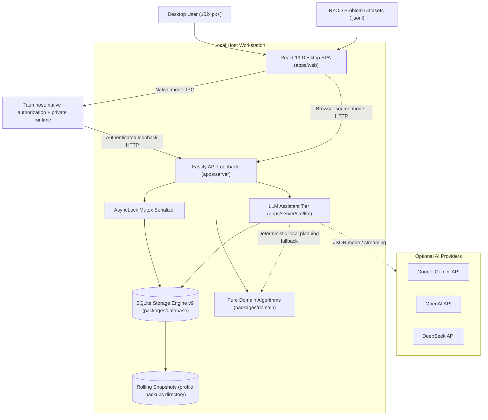

# Architecture

The repository baseline implements an offline-first, Bring-Your-Own-Data (BYOD) practice workbench. It provides shared TypeScript contracts, transactional SQLite storage (schema v9), a local Fastify loopback API, a multi-provider LLM assistant tier (Gemini, OpenAI, DeepSeek), and a bilingual React web client, and a Windows Tauri host with a private Node 24.15.0 runtime.

The interactive diagram predates the native shell and shows the shared application core; the current native boundary is described below. For an interactive SVG diagram with dark/light themes, search, pan/zoom, and guided views, see the [Interactive Architecture Diagram](diagrams/architecture.html).

## Visual topology

## Component structure

- **`packages/contracts`**: Validated Zod schemas and normalization pipelines for JSON Lines parsing, preflight preview, import summaries, catalog filtering, manual practice records, progress snapshots, conflict evaluation, planning lifecycle, and dashboard analytics.
- **`packages/database`**: High-performance SQLite engine (`DatabaseSync`) managing schema migrations (supported v3–v8 to v9), preflight validation, atomic multi-table writes, point-in-time backups via native Node SQLite backup, daily backup pruning, problem notes store, planning store, dashboard query layer, and offline restore.
- **`packages/domain`**: Pure algorithmic domain logic for deterministic quota calculation (largest remainder), review candidate selection, streak calculation, yearly heatmap matrix generation, and activity pagination.
- **`apps/server`**: Local Fastify API bound to `127.0.0.1`. Exposes `/api/v1` endpoints for catalog, imports, practice records, progress snapshots, recommendation planning, problem notes, read-only dashboard overview and activity stream, and multi-provider LLM assistant with write serialization mutex and static SPA hosting.
- **`apps/desktop`**: Rust host and NSIS packaging. Owns native file destinations, parsed external URL launching, session secrets, bounded startup/health checks, and a Job-bound Node child. See [desktop lifecycle and storage](desktop.md).
- **`apps/web`**: React/Vite desktop SPA with four primary destinations and contextual workspaces. App owns the single `useDailyPlan` controller and a small React context for mutation invalidation, timezone and shared practice overlays. Hash navigation uses existing React state; visited workspaces retain drafts, filters and scroll. `PracticeEditor`, `Dialog`, `Field`, `Feedback` and `Pagination` are shared; catalog ingestion and progress ingestion have independent ownership. CSS variables define warm light/dark palettes, spacing and motion. Statistics alone hosts full Recharts analysis.

## Ingestion pipeline

1. **Input Submission**: User provides JSON Lines (`.jsonl`) via file selection or clipboard paste in `apps/web`.
2. **Preflight Inspection**: `POST /api/v1/imports/preview` parses lines, detects intra-batch duplicates and conflicts, matches against existing database records, identifies modified fields, and calculates exact insertion/update/unchanged counts without mutating the database.
3. **Atomic Commit**: `POST /api/v1/imports` accepts a valid `previewId`. Within a single SQLite transaction, problem records, tag associations, audit history, complete import results, and catalog revision are persisted together. Any failure triggers a complete rollback.
4. **Data Protection**: Pre-import snapshots and pre-migration backups are automatically created and retained according to policy (14 daily snapshots retained).

## Write and recovery ownership

The standalone server uses `await CatalogStore.open(db, { backupDir })`; `commitImport` and `importJsonl` also return promises. The synchronous constructor is available for unbacked test storage and rejects enabled backup configuration. Each store queues import writes, awaits its snapshot, and checks the preview revision again inside the transaction. The API replays committed IDs from SQLite before consulting the temporary preview cache.

The server and restore command hold the same per-database process lease. Restore stages a verified source and snapshots the existing destination through SQLite, including committed WAL pages. SQLite then restores the destination transactionally; the command retains a safety snapshot and attempts rollback on failure. Close other database tools as well: the lease coordinates this application, not arbitrary SQLite clients.

Practice creation normalizes and fingerprints the creation payload. A SQLite transaction checks the optional operation ID, inserts the practice and replay mapping, and increments the practice revision. Replaying the same ID/payload returns the saved row; mismatched content returns 409. Without an ID, legacy callers retain independent-create semantics. Client retry intents persist in session storage, but SQLite provides the authoritative duplicate guard. PATCH/DELETE can reject stale expected record revisions. Acknowledged records update only their own completion evidence using the shared domain ordering rule before background reconciliation; failed refresh never undoes a saved write.

The workbench invalidates pending file reads and preview responses on input changes. Only the current preview is eligible for commit, and inputs are frozen while committing. Catalog request failures have visible errors and retry controls; superseded filter responses cannot overwrite current results.

## Topic analysis and adaptive projections

The planning store builds a request-local indexed evidence context. Insights use fixed review states; adaptive states remain separate and never overwrite the fixed cache. Generation, replacement and overrides share the candidate builder, constrain model reordering locally and persist minimal explanation facts. Read-only insights do not write revisions or call Gemini. See [topic practice insights](topic-practice-insights.md) for thresholds and compatibility.

## Multi-provider AI boundary

The server's `llm/assistant.ts` dispatches to isolated Gemini, OpenAI and DeepSeek adapters. Startup and settings writes share configuration resolution. Planning results carry provider provenance; progress import failures preserve typed HTTP errors. Gemini module paths remain compatibility exports. See [AI provider configuration](llm-providers.md) for credentials, reset behavior and fallback boundaries.
